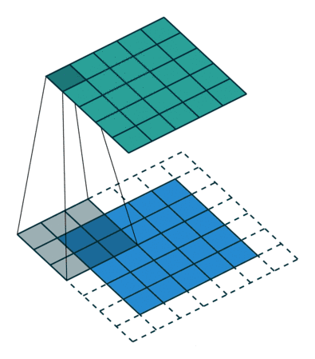
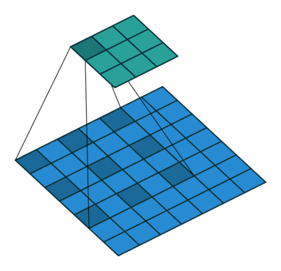
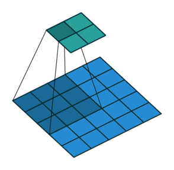
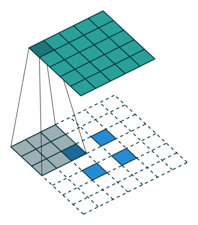

[TOC]

# 第五章 卷积神经网络（CNN）

标签（空格分隔）： 深度学习

---
## 5.1 卷积神经网络的组成层
在卷积神经网络中，有3种最主要的层：
> * 卷积运算层
> * 池化层
> * 全连接层

一个完整的神经网络就是由这三种层叠加组成的。

**结构示例**

拿CIFAR-10数据集举例，一个典型的该数据集上的卷积神经网络分类器应该有[INPUT - CONV - RELU - POOL - FC]的结构，

> * INPUT[32\*32\*3]包含原始图片数据中的全部像素，长宽都是32，有RGB 3个颜色通道。
> * CONV卷积层中，每个神经元会和上一层的若干小区域连接，计算权重和小区域像素的内积，举个例子12个卷积核产出的结果数据是[32\*32\*12]。
> * RELU层，就是神经元激励层，主要的计算就是max(0,x)，结果数据依旧是[32\*32\*12]。
> * POOLing层做的事情，可以理解成一个下采样，可能得到的结果维度就变为[16\*16\*12]了。
> * 全连接层一般用于最后计算类别得分，得到的结果为[1\*1\*10]的，其中的10对应10个不同的类别。和名字一样，这一层的所有神经元会和上一层的所有神经元有连接。

这样，卷积神经网络作为一个中间的通道，就一步步把原始的图像数据转成最后的类别得分了。有一个点我们要提一下，刚才说到了有几种不同的神经网络层，其中有一些层是有待训练参数的，另外一些没有。详细一点说，卷积层和全连接层包含权重和偏移的；而RELU和POOLing层只是一个固定的函数运算，是不包含权重和偏移参数的。不过POOLing层包含了我们手动指定的超参数，这个我们之后会提到。

**总结一下**：
* （1）一个卷积神经网络由多种不同类型的层(卷积层/RELU层/POOLing层/全连接层等)叠加而成。
* （2）每一层的输入结构是3维的数据，计算完输出依旧是3维的数据。
* （3）卷积层和全连接层包含训练参数，RELU 和 POOLing 层不包含。
* （4）卷积层，全连接层和 POOLing 层包含超参数，RELU 层没有。

下图为 CIFAR-10 数据集构建的一个卷积神经网络结构示意图：


## 5.2 卷积如何检测边缘信息？

卷积运算是卷积神经网络最基本的组成部分，神经网络的前几层首先检测边缘，然后，后面的层有可能检测到物体的部分区域，更靠后的一些层可能检测到完整的物体。

越往后卷积核的视野越大， 边缘--->局部------->整体

先介绍一个概念，过滤器：


这是一个3*3的过滤器，是一个矩阵，数值如上所示。

假设我们有一个6*6的灰度图像：


把这个图像与过滤器进行卷积运算，卷积运算在此处用“*”表示。


我们看一下发生了什么事，把过滤器最准图像左上方3*3的范围，逐一相乘并相加，得到-5。

同理，将过滤器右移进行相同操作，再下移，直到过滤器对准图像右下角最后一格。依次运算得到一个4*4的矩阵。

OK，了解了过滤器以及卷积运算后，让我们看看为何过滤器能检测物体边缘：

举一个最简单的例子：


这张图片如上所示，左半边全是白的，右半边全是灰的，过滤器还是用之前那个，把他们进行卷积：


可以看到，最终得到的结果中间是一段白色，两边为灰色，于是垂直边缘被找到了。为什么呢？因为在6*6图像中红框标出来的部分，也就是图像中的分界线所在部分，与过滤器进行卷积，结果是30。而在不是分界线的所有部分进行卷积，结果都为0.

在这个图中，白色的分界线很粗，那是因为6*6的图像实在太小了，若是换成1000*1000的图像，我们会发现在最终结果中，分界线不粗且很明显。

这就是检测物体垂直边缘的例子，水平边缘的话只需将过滤器旋转90度。

## 5.3 卷积的几个基本定义？

首先，我们需要就定义一个卷积层的几个参数达成一致。

### 5.3.1 卷积核大小

（Kernel Size）: 卷积核的大小定义了卷积的视图范围。二维的常见选择大小是3，即3×3像素。

### 5.3.2 卷积核的步长

（Stride）: Stride定义了内核的步长。虽然它的默认值通常为1，但我们可以将步长设置为2，然后对类似于MaxPooling的图像进行向下采样。

### 5.3.3 边缘填充

（Padding）: Padding用于填充输入图像的边界。一个(半)填充的卷积将使空间输出维度与输入相等，而如果卷积核大于1，则未被填充的卷积将会使一些边界消失。

### 5.3.4 输入和输出通道

 一个卷积层接受一定数量的输入通道(I)，并计算一个特定数量的输出通道(O)，这一层所需的参数可以由 $I*O*K$计算，K等于卷积核中值的数量。

## 5.4 卷积的网络类型分类？

### 5.4.1 普通卷积



### 5.4.2 扩张卷积  **（Dilated Convolutions）**  阿鲁斯卷积

又名带洞的（atrous）卷积，扩张的卷积引入了另一个被称为扩张率（dilation rate）的卷积层。这定义了卷积核中值之间的间隔。一个3×3卷积核的扩张率为2，它的视图与5×5卷积核相同，而只使用9个参数。想象一下，取一个5×5卷积核，每两行或两列删除一行或一列。

这将以同样的计算代价提供更广阔的视角。扩张的卷积在实时分割领域特别受欢迎。如果需要广泛的视图，并且不能负担多个卷积或更大的卷积核，那么就使用它们。
举例：



- [x] ### 5.4.3 转置卷积

转置卷积也就是反卷积（deconvolution）。虽然有些人经常直接叫它反卷积，但严格意义上讲是不合适的，因为它不符合一个反卷积的概念。反卷积确实存在，但它们在深度学习领域并不常见。一个实际的反卷积会恢复卷积的过程。想象一下，将一个图像放入一个卷积层中。现在把输出传递到一个黑盒子里，然后你的原始图像会再次出来。这个黑盒子就完成了一个反卷积。这是一个卷积层的数学逆过程。

一个转置的卷积在某种程度上是相似的，因为它产生的相同的空间分辨率是一个假设的反卷积层。然而，在值上执行的实际数学操作是不同的。一个转置的卷积层执行一个常规的卷积，但是它会恢复它的空间变换（spatial transformation）。

在这一点上，你应该非常困惑，让我们来看一个具体的例子：
5×5的图像被馈送到一个卷积层。步长设置为2，无边界填充，而卷积核是3×3。结果得到了2×2的图像。



如果我们想要逆转这个过程，我们需要反向的数学运算，以便从我们输入的每个像素中生成9个值。然后，我们将步长设置为2来遍历输出图像。这就是一个反卷积过程。

一个转置的卷积并不会这样做。唯一的共同点是，它保证输出将是一个5×5的图像，同时仍然执行正常的卷积运算。为了实现这一点，我们需要在输入上执行一些奇特的填充。

正如你现在所能想象的，这一步不会逆转上面的过程。至少不考虑数值。

它仅仅是重新构造了之前的空间分辨率并进行了卷积运算。这可能不是数学上的逆过程，但是对于编码-解码器（Encoder-Decoder）架构来说，这仍然是非常有用的。这样我们就可以把图像的尺度上推（upscaling）和卷积结合起来，而不是做两个分离的过程。



如果我们想反转这个过程，我们需要反数学运算，以便从我们输入的每个像素中生成9个值。之后，我们以2步幅的设置来遍历输出图像。这将是一个反卷积。

### 5.4.4 可分离卷积

在一个可分离卷积中，我们可以将内核操作拆分成多个步骤。我们用 $y = conv（x，k)$表示卷积，其中 $y$ 是输出图像，$x$ 是输入图像，$k$ 是内核。这一步很简单。接下来，我们假设 $k$ 可以由下面这个等式计算得出：$k = k_1\cdot k_2$。这将使它成为一个可分离的卷积，因为我们可以通过对 $k_1$ 和 $k_2$  做2个一维卷积来取得相同的结果，而不是用 $k$ 做二维卷积。


我们以通常用于图像处理的 *Sobel* 内核为例。你可以通过乘以向量$[1，0，-1]$和$[1,2,1] ^T$获得相同的内核。在执行相同的操作时，你只需要6个而不是9个参数。

上面的示例显示了所谓的空间可分离卷积，据我所知，这并不是在深度学习中使用的。我只是想确保在他人费劲地操作时，你不会受到如此困惑。在神经网络中，我们通常使用的是一种叫做深度可分离卷积的神经网络。

例子：

假设我们在一个16输入通道和32输出通道上有一个3x3的卷积层。那么将要发生的就是16个通道中的每一个都由32个3x3的内核进行遍历，从而产生512（16x32）的特征映射。接下来，我们通过将每个输入通道中的特征映射相加从而合成一个大的特征映射。由于我们可以进行此操作32次，因此我们得到了期望的32个输出通道。总计需要 4608（16x32x3x3）个参数。

对于分离卷积：

遍历16个通道，每一个都有一个3x3的内核，可以给出16个特征映射。现在，在做任何合并操作之前，我们将遍历这16个特征映射，每个都含有32个1x1的卷积，然后才逐此开始添加，总计 656（16x3x3 + 16x32x1x1）个参数

这样做是因为假设空间和深度信息是可以去耦的。而反观Xception模型的表现，可以发现这个理论似乎是有效的。其实，可移动设备中也可以使用深度可分离卷积。因为它们的参数是可以有效利用的。


## 5.5 图解12种不同类型的2D卷积？

http://www.sohu.com/a/159591827_390227

## 5.6 2D卷积与3D卷积有什么区别？

### 5.6.1 2D卷积

2D卷积操作如图所示，为了解释的更清楚，分别展示了单通道和多通道的操作。且为了画图方便，假定只有1个filter，即输出图像只有一个chanel。

其中，针对单通道，输入图像的channel为1，卷积核尺寸为 (k_h, k_w, 1)，卷积核在输入图像上的的空间维度（即(height,width)两维）上进行进行滑窗操作，每次滑窗和 (k_h, k_w) 窗口内的values进行卷积操作（现在都用相关操作取代），得到输出图像中的一个value。针对多通道，假定输入图像的channel为3，卷积核尺寸为 (k_h, k_w, 3)， 卷积核在输入图像上的的空间维度（即(h, w)两维）上进行进行滑窗操作，每次滑窗与3个channels上的 (k_h, k_w) 窗口内的所有的values进行相关操作，得到输出图像中的一个value。


### 5.6.2 3D卷积

3D卷积操作如图2所示，同样分为单通道和多通道，且只使用一个filter，输出一个channel。其中，针对单通道，与2D卷积不同之处在于，输入图像多了一个 length 维度，卷积核也多了一个k_l维度，因此卷积核在输入3D图像的空间维度（height和widthw维）和length维度上均进行滑窗操作，每次滑窗与 (k_h, k_w, k_l) 窗口内的values进行相关操作，得到输出3D图像中的一个value.

针对多通道，则与2D卷积的操作一样，每次滑窗与3个channels上的 (k_h, k_w, k_l) 窗口内的所有values进行相关操作，得到输出3D图像中的一个value。


## 5.7 有哪些池化方法？

在卷积神经网络中，我们经常会碰到池化操作，而池化层往往在卷积层后面，通过池化来降低卷积层输出的特征向量，同时改善结果（不易出现过拟合）。

为什么可以通过降低维度呢？

因为图像具有一种“静态性”的属性，这也就意味着在一个图像区域有用的特征极有可能在另一个区域同样适用。因此，为了描述大的图像，一个很自然的想法就是对不同位置的特征进行聚合统计，例如，人们可以计算图像一个区域上的某个特定特征的平均值 (或最大值)来代表这个区域的特征。[1]

### 5.7.1 一般池化（General Pooling）

==池化作用于图像中不重合==的区域（这与卷积操作不同），过程如下图。


我们定义池化窗口的大小为sizeX，即下图中红色正方形的边长，定义两个相邻池化窗口的水平位移/竖直位移为stride。一般池化由于每一池化窗口都是不重复的，所以==size X=stride==。


最常见的池化操作为平均池化mean pooling和最大池化max pooling：
* 平均池化：计算图像区域的平均值作为该区域池化后的值。
* 最大池化：选图像区域的最大值作为该区域池化后的值。

### 5.7.2 重叠池化（General Pooling）
重叠池化正如其名字所说的，相邻池化窗口之间会有重叠区域，此时sizeX>stride。论文中[2]中，作者使用了重叠池化，其他的设置都不变的情况下， top-1和top-5 的错误率分别减少了0.4% 和0.3%。

### 5.7.3 空金字塔池化（Spatial Pyramid Pooling）

空间金字塔池化可以把任何尺度的图像的卷积特征转化成相同维度，这不仅可以让CNN处理任意尺度的图像，还能避免cropping和warping操作，导致一些信息的丢失，具有非常重要的意义。

一般的CNN都需要输入图像的大小是固定的，这是因为全连接层的输入需要固定输入维度，但在卷积操作是没有对图像尺度有限制，所以作者提出了空间金字塔池化，先让图像进行卷积操作，然后转化成维度相同的特征输入到全连接层，这个可以把CNN扩展到任意大小的图像。


空间金字塔池化的思想来自于Spatial Pyramid Model,它一个pooling变成了多个scale的pooling。==用不同大小池化窗口==作用于卷积特征，我们可以得到1X1,2X2,4X4的池化结果，由于conv5中共有256个过滤器，所以得到1个256维的特征，4个256维特征，以及16个256维的特征，然后把这21个256维特征链接起来输入全连接层，通过这种方式把不同大小的图像转化成相同维度的特征。


对于不同的图像要得到相同大小的pooling结果，就需要根据图像的大小动态的计算池化窗口的大小和步长。假设conv5输出的大小为$a*a$，需要得到$n*n$大小的池化结果，可以让窗口大小sizeX为[a/n]，步长为[a/n]。下图以conv5输出的大小为13*13为例。


疑问：如果conv5输出的大小为 $14*14$，[pool $1*1$]的 sizeX=stride=14，[pool $2*2$]的s izeX=stride=7，这些都没有问题，但是，[pool $4*4$ ]的sizeX=5，stride=4，最后一列和最后一行特征没有被池化操作计算在内。

SPP其实就是一种多个scale的pooling，可以获取图像中的多尺度信息；在CNN中加入SPP后，可以让CNN处理任意大小的输入，这让模型变得更加的flexible。

- [x] ## 5.8 1x1卷积作用？

1×1的卷积大概有两个方面的作用：

1. 实现跨通道的交互和信息整合。
2. 进行卷积核通道数的降维和升维。

下面详细解释一下：[cccp 和 1*1 卷积层解释](https://blog.csdn.net/hellocsz/article/details/80887199)
1. 1×1的卷积层（可能）引起人们的重视是在NIN的结构中，论文中林敏师兄的想法是利用MLP代替传统的线性卷积核，从而提高网络的表达能力。文中同时利用了跨通道pooling的角度解释，认为文中提出的MLP其实等价于在传统卷积核后面接cccp层，从而实现多个feature map的线性组合，实现跨通道的信息整合。而==cccp层是等价于1×1卷积==的，因此细看NIN的caffe实现，就是在每个传统卷积层后面接了两个cccp层（其实就是接了两个1×1的卷积层）。

2. 进行降维和升维引起人们重视的（可能）是在GoogLeNet里。对于每一个Inception模块（如下图），原始模块是左图，右图中是加入了1×1卷积进行降维的。虽然左图的卷积核都比较小，但是当输入和输出的通道数很大时，乘起来也会使得卷积核参数变的很大，而右图加入1×1卷积后可以降低输入的通道数，卷积核参数、运算复杂度也就跟着降下来了。以GoogLeNet的3a模块为例，输入的feature map是28×28×192，3a模块中1×1卷积通道为64，3×3卷积通道为128,5×5卷积通道为32，如果是左图结构，那么卷积核参数为1×1×192×64+3×3×192×128+5×5×192×32，而右图对3×3和5×5卷积层前分别加入了通道数为96和16的1×1卷积层，这样卷积核参数就变成了1×1×192×64+（1×1×192×96+3×3×96×128）+（1×1×192×16+5×5×16×32），参数大约减少到原来的三分之一。同时在并行pooling层后面加入1×1卷积层后也可以降低输出的feature map数量，左图pooling后feature map是不变的，再加卷积层得到的feature map，会使输出的feature map扩大到416，如果每个模块都这样，网络的输出会越来越大。而右图在pooling后面加了通道为32的1×1卷积，使得输出的feature map数降到了256。GoogLeNet利用1×1的卷积降维后，得到了更为紧凑的网络结构，虽然总共有22层，但是参数数量却只是8层的AlexNet的十二分之一（当然也有很大一部分原因是去掉了全连接层）。


最近大热的MSRA的ResNet同样也利用了1×1卷积，并且是在3×3卷积层的前后都使用了，不仅进行了降维，还进行了升维，使得卷积层的输入和输出的通道数都减小，参数数量进一步减少，如下图的结构。（不然真不敢想象152层的网络要怎么跑起来TAT）


## 5.9 卷积层和池化层有什么区别？

首先可以从结构上可以看出，卷积之后输出层的维度减小，深度变深。但池化层深度不变。同时池化可以把很多数据用最大值或者平均值代替。目的是降低数据量。降低训练的参数。对于输入层，当其中像素在邻域发生微小位移时，池化层的输出是不变的，从而能提升鲁棒性。而卷积则是把数据通过一个卷积核变化成特征，便于后面的分离。

1:卷积

当从一个大尺寸图像中随机选取一小块，比如说 8x8 作为样本，并且从这个小块样本中学习到了一些特征，这时我们可以把从这个 8x8 样本中学习到的特征作为探测器，应用到这个图像的任意地方中去。特别是，我们可以用从 8x8 样本中所学习到的特征跟原本的大尺寸图像作卷积，从而对这个大尺寸图像上的任一位置获得一个不同特征的激活值。

下面给出一个具体的例子：假设你已经从一个 96x96 的图像中学习到了它的一个 8x8 的样本所具有的特征，假设这是由有 100 个隐含单元的自编码完成的。为了得到卷积特征，需要对 96x96 的图像的每个 8x8 的小块图像区域都进行卷积运算。也就是说，抽取 8x8 的小块区域，并且从起始坐标开始依次标记为（1，1），（1，2），...，一直到（89，89），然后对抽取的区域逐个运行训练过的稀疏自编码来得到特征的激活值。在这个例子里，显然可以得到 100 个集合，每个集合含有 89x89 (96-8+1)个卷积特征。


2：说下池化，其实池化很容易理解，先看图：

转自：  http://blog.csdn.net/silence1214/article/details/11809947


比如上方左侧矩阵A是 $20*20$ 的矩阵要进行大小为 $10*10$ 的池化，那么左侧图中的红色就是10*10的大小，对应到右侧的矩阵，右侧每个元素的值，是左侧红色矩阵每个元素的值得和再处于红色矩阵的元素个数，也就是平均值形式的池化。

3：上面说了下卷积和池化，再说下计算中需要注意到的。在代码中使用的是彩色图，彩色图有3个通道，那么对于==每一个通道来说要单独进行卷积和池化==，有一个地方尤其是进行卷积的时候要注意到，隐藏层的每一个值是对应到一幅图的3个通道穿起来的，所以==分3个通道进行卷积之后要加起来==，正好才能对应到一个隐藏层的神经元上，也就是一个feature上去。

## 5.10 卷积核一定越大越好？

AlexNet中用到了一些非常大的卷积核，比如11×11、5×5卷积核，之前人们的观念是，卷积核越大，receptive field（感受野）越大，看到的图片信息越多，因此获得的特征越好。虽说如此，但是大的卷积核会导致计算量的暴增，不利于模型深度的增加，计算性能也会降低。于是在VGG（最早使用）、Inception网络中，利用2个3×3卷积核的组合比1个5×5卷积核的效果更佳，同时参数量（3×3×2+1 VS 5×5×1+1） 被降低，因此后来3×3卷积核被广泛应用在各种模型中。多个小的卷积核叠加使用要远比一个大的卷积核单独使用效果要好的多，在连通性不变的情况下，大大降低了参数个数和计算复杂度。当然，卷积核也不是越小越好，对于特别稀疏的数据比如下图所示，当使用比较小的卷积核的时候可能无法表示其特征，如果采用较大的卷积核则会导致复杂度极大的增加。总而言之，我们应该选择多个相对小的卷积核来进行卷积。

## 5.11 每层卷积只能用一种尺寸的卷积核？

传统的层叠式网络，基本上都是一个个卷积层的堆叠，每层只用一个尺寸的卷积核，例如VGG结构中使用了大量的3×3卷积层。事实上，同一层feature map可以分别使用多个不同尺寸的卷积核，以获得不同尺度的特征，再把这些特征结合起来，得到的特征往往比使用单一卷积核的要好，谷歌的GoogLeNet，或者说Inception系列的网络，就使用了多个卷积核的结构：


如上图所示，一个输入的feature map 分别同时经过1×1、3×3、5×5的卷积核的处理，得出的特征再组合起来，获得更佳的特征。

## 5.12 怎样才能减少卷积层参数量？

发明GoogleNet的团队发现，如果仅仅引入多个尺寸的卷积核，会带来大量的额外的参数，受到Network In Network中1×1卷积核的启发，为了解决这个问题，他们往Inception结构中加入了一些1×1的卷积核，如图所示：


加入1×1卷积核的Inception结构


根据上图，我们来做个对比计算，假设输入feature map的维度为256维，要求输出维度也是256维。有以下两种操作：  
* （1）256维的输入直接经过一个3×3×256的卷积层，输出一个256维的feature map，那么参数量为：256×3×3×256 = 589,824  
* （2）256维的输入先经过一个1×1×64的卷积层，再经过一个3×3×64的卷积层，最后经过一个1×1×256的卷积层，输出256维，参数量为：256×1×1×64 + 64×3×3×64 + 64×1×1×256 = 69,632。足足把第一种操作的参数量降低到九分之一！

1×1卷积核也被认为是影响深远的操作，往后大型的网络为了降低参数量都会应用上1×1卷积核。

## 5.13 卷积操作时必须同时考虑通道和区域吗？


标准的卷积过程可以看上图，一个2×2的卷积核在卷积时，对应图像区域中的所有通道均被同时考虑，问题在于，为什么一定要同时考虑图像区域和通道？我们为什么不能把通道和空间区域分开考虑？


Xception网络就是基于以上的问题发明而来。我们首先对每一个通道进行各自的卷积操作，有多少个通道就有多少个过滤器。得到新的通道feature maps之后，这时再对这批新的通道feature maps进行标准的1×1跨通道卷积操作。这种操作被称为 “DepthWise convolution” ，缩写“DW”。  

这种操作是相当有效的，在imagenet 1000类分类任务中已经超过了InceptionV3的表现，而且也同时减少了大量的参数，我们来算一算，假设输入通道数为3，要求输出通道数为256，两种做法： 

1. 直接接一个3×3×256的卷积核，参数量为：3×3×3×256 = 6,912  
2. DW操作，分两步完成，参数量为：3×3×3 + 3×1×1×256 = 795，又把参数量降低到九分之一！  

因此，一个depthwise操作比标准的卷积操作降低不少的参数量，同时论文中指出这个模型得到了更好的分类效果。

## 5.14 采用宽卷积的好处有什么？

### 5.14.1 窄卷积和宽卷积

对于窄卷积来说，是从第一个点开始做卷积，每次窗口滑动固定步幅。比如下图左部分为窄卷积。那么注意到越在边缘的位置被卷积的次数越少。于是有了宽卷积的方法，可以看作在卷积之前在边缘用0补充，常见有两种情况，一个是全补充，入下图右部分，这样输出大于输入的维度。另一种常用的方法是补充一部0值，使得输出和输入的维度一致。这里文中给了一个公式 。这里npadding在全补充里是filter-1，在输入输出相等时，就要主要奇偶性了，注意到卷积核常为奇数。


### 5.14.2 为什么采用宽卷积？

 通过将输入边角的值纳入到滑窗中心进行计算，以便损失更少的信息。

## 5.15 卷积层输出的深度与哪个部件的个数相同？

 输出深度（通道）与卷积核（过滤器）的个数相等。

## 5.16 如何得到卷积层输出的深度？

参数共享：在卷积层中使用参数共享是用来控制参数的数量。假设在第一个卷积层就有55x55x96=290,400个神经元，每个有11x11x3=364个参数和1个偏差。将这些合起来就是290400x364=105,705,600个参数。单单第一层就有这么多参数，显然这个数目是非常大的。

作一个合理的假设：如果一个特征在计算某个空间位置(x,y)的时候有用，那么它在计算另一个不同位置(x2,y2)的时候也有用。基于这个假设，可以显著地减少参数数量。换言之，就是将深度维度上一个单独的2维切片看做深度切片（depth slice），比如一个数据体尺寸为[55x55x96]的就有96个深度切片，每个尺寸为[55x55]。在每个深度切片上的神经元都使用同样的权重和偏差。在这样的参数共享下，例子中的第一个卷积层就只有96个不同的权重集了，一个权重集对应一个深度切片，共有96x11x11x3=34,848个不同的权重，或34,944个参数（+96个偏差）。

```w_conv1=weight_variable([5,5,1,32])```

可以看出，上面的32表示的是卷积层输出的深度，因为大家都明白width和height都可以通过公式计算得到，但是很多文献都没有告诉深度是如何得到的，下面是我的认识： 

1. 因为这个深度是没有公式可以计算出来的，因为深度是一个经验值，如上面代码的32 ，其实是一个经验值，是通过调整参数发现32是一个最合适的值，可以得到最好的准确率，但是不同的图像的深度是不一样的。
2. 这个深度表示用了多少个卷积核，下面这个图可以说明一下：


上图就可以很有效的说明 ：卷积层输出的深度==卷积核的个数。

## 5.17 激活函数通常放在卷积神经网络的那个操作之后？

 通常放在卷积层之后。

## 5.18 如何理解最大池化层有几分缩小？

池化层：对输入的特征图进行压缩，一方面使特征图变小，简化网络计算复杂度；一方面进行特征压缩，提取主要特征。

池化操作一般有两种，一种是Avy Pooling,一种是max Pooling。


同样地采用一个2*2的filter,max pooling是在每一个区域中寻找最大值，这里的stride=2,最终在原特征图中提取主要特征得到右图。  

>注1：（Avy pooling现在不怎么用了，方法是对每一个2\*2的区域元素求和，再除以4，得到主要特征），而一般的filter取2\*2,最大取3\*3,stride取2，压缩为原来的1/4.  
>注2：这里的pooling操作是特征图缩小，有可能影响网络的准确度，因此可以通过增加特征图的深度来弥补。

## 5.19 理解图像卷积与反卷积

### 5.19.1 图像卷积

首先给出一个输入输出结果


那他是怎样计算的呢？

卷积的时候需要对卷积核进行180的旋转，同时卷积核中心与需计算的图像像素对齐，输出结构为中心对齐像素的一个新的像素值，计算例子如下：


这样计算出左上角(即第一行第一列)像素的卷积后像素值。

给出一个更直观的例子，从左到右看，原像素经过卷积由1变成-8。


通过滑动卷积核，就可以得到整张图片的卷积结果


### 5.19.2 图像反卷积

这里提到的反卷积跟1维信号处理的反卷积计算是很不一样的，FCN作者称为backwards convolution，有人称Deconvolution layer is a very unfortunate name and should rather be called a transposed convolutional layer. 我们可以知道，在CNN中有con layer与pool layer，con layer进行对图像卷积提取特征，pool layer 对图像缩小一半筛选重要特征，对于经典的图像识别CNN网络，如IMAGENET，最后输出结果是1X1X1000，1000是类别种类，1x1得到的是。FCN作者，或者后来对end to end研究的人员，就是对最终1x1的结果使用反卷积（事实上FCN作者最后的输出不是1X1，是图片大小的32分之一，但不影响反卷积的使用）。

这里图像的反卷积与full卷积原理是一样的，使用了这一种反卷积手段使得图像可以变大，FCN作者使用的方法是这里所说反卷积的一种变体，这样就可以获得相应的像素值，图像可以实现end to end。


这里说另外一种反卷积做法，假设原图是3\*3，首先使用上采样让图像变成7\*7，可以看到图像多了很多空白的像素点。使用一个3\*3的卷积核对图像进行滑动步长为1的valid卷积，得到一个5\*5的图像，我们知道的是使用上采样扩大图片，使用反卷积填充图像内容，使得图像内容变得丰富，这也是CNN输出end to end结果的一种方法。韩国作者Hyeonwoo Noh使用VGG16层CNN网络后面加上对称的16层反卷积与上采样网络实现end to end 输出，其不同层上采样与反卷积变化效果如下：


经过上面的解释与推导，对卷积有基本的了解，但是在图像上的deconvolution究竟是怎么一回事，可能还是不能够很好的理解，因此这里再对这个过程解释一下。 目前使用得最多的deconvolution有2种，上文都已经介绍。  

* 方法1：full卷积， 完整的卷积可以使得原来的定义域变大。
* 方法2：记录pooling index，然后扩大空间，再用卷积填充。

图像的deconvolution过程如下：


输入：2x2， 卷积核：4x4， 滑动步长：3， 输出：7x7 

即输入为2x2的图片经过4x4的卷积核进行步长为3的反卷积的过程 

1. 输入图片每个像素进行一次full卷积，根据full卷积大小计算可以知道每个像素的卷积后大小为 1+4-1=4， 即4x4大小的特征图，输入有4个像素所以4个4x4的特征图 
2. 将4个特征图进行步长为3的fusion（即相加）； 例如红色的特征图仍然是在原来输入位置（左上角），绿色还是在原来的位置（右上角），步长为3是指每隔3个像素进行fusion，重叠部分进行相加，即输出的第1行第4列是由红色特阵图的第一行第四列与绿色特征图的第一行第一列相加得到，其他如此类推。  

可以看出翻卷积的大小是由卷积核大小与滑动步长决定， in是输入大小， k是卷积核大小， s是滑动步长， out是输出大小 得到 out = (in - 1) * s + k 上图过程就是， (2 - 1) * 3 + 4 = 7

## 5.20 不同卷积后图像大小计算？

### 5.20.1 类型划分

2维卷积的计算分为了3类：1.full   2.same   3. valid

1、**full**


蓝色为原图像，白色为对应卷积所增加的padding，通常全部为0，绿色是卷积后图片。图6的卷积的滑动是从卷积核右下角与图片左上角重叠开始进行卷积，滑动步长为1，卷积核的中心元素对应卷积后图像的像素点。可以看到卷积后的图像是4X4，比原图2X2大了，我们还记1维卷积大小是n1+n2-1，这里原图是2X2，卷积核3X3，卷积后结果是4X4，与一维完全对应起来了。其实这才是完整的卷积计算，其他比它小的卷积结果都是省去了部分像素的卷积

2、**same**


3、**valid**


### 5.20.2 计算公式

这里，我们可以总结出full，same，valid三种卷积后图像大小的计算公式：

1. full: 滑动步长为1，图片大小为N1xN1，卷积核大小为N2xN2，卷积后图像大小：N1+N2-1 x N1+N2-1。
2. same: 滑动步长为1，图片大小为N1xN1，卷积核大小为N2xN2，卷积后图像大小：N1xN1。
3. valid:滑动步长为S，图片大小为N1xN1，卷积核大小为N2xN2，卷积后图像大小：(N1-N2)/S+1 x (N1-N2)/S+1。

## 5.21 步长、填充大小与输入输出关系总结？

在设计深度学习网络的时候，需要计算输入尺寸和输出尺寸，那么就要设计卷积层的的各种参数。这里有一些设计时候的计算公式，方便得到各层的参数。

这里简化下，约定：


### 5.21.1 没有0填充，单位步长


### 5.21.2 零填充，单位步长


<1>半填充


<2>全填充


参考图如下图所示


### 5.21.3 不填充，非单位步长


### 5.21.4 零填充，非单位步长


http://blog.csdn.net/u011692048/article/details/77572024
https://arxiv.org/pdf/1603.07285.pdf

## 5.22 理解反卷积和棋盘效应

### 5.22.1 为什么出现棋盘现象？

图像生成网络的上采样部分通常用反卷积网络，不合理的卷积核大小和步长会使反卷积操作产生棋盘效应 (checkerboard artifacts)。


重叠图案也在二维中形成。两个轴上的不均匀重叠相乘，产生不同亮度的棋盘状图案。

事实上，不均匀重叠往往在二维上更极端！因为两个模式相乘，所以它的不均匀性是原来的平方。例如，在一个维度中，一个步长为2，大小为3的反卷积的输出是其输入的两倍，但在二维中，输出是输入的4倍。

现在，生成图像时，神经网络通常使用多层反卷积，从一系列较低分辨率的描述中迭代建立更大的图像。虽然这些堆栈的反卷积可以消除棋盘效应，但它们经常混合，在更多尺度上产生棋盘效应。

直观地看，假设生成的图像中包含1只黑猫。黑猫身体部分的像素颜色应平滑过渡，或极端地说，该部分应全为黑色。实际生成的图像中该部分却有深深浅浅的近黑方块组成，很像棋盘的网格，即棋盘效应。

https://distill.pub/2016/deconv-checkerboard/
http://blog.csdn.net/shadow_guo/article/details/52862161

### 5.22.2 有哪些方法可以避免棋盘效应？

（1）第一种方法是用到的反卷积核的大小可被步长整除，从而避免重叠效应。与最近成功用于图像超分辨率的技术“子像素卷积”（sub-pixel convolution）等价。


（2）另一种方法是从卷积操作中分离出对卷积后更高分辨率的特征图上采样来计算特征。例如，可以先缩放图像（最近邻插值或双线性插值），再卷积。


反卷积与不同缩放卷积方法都是线性操作，并可用矩阵去解释。对于每个输出窗口，反卷积操作的输入唯一，缩放卷积会以阻碍高频棋盘效应的方式来隐式地集中权重（weight-tying）。

#### 缩放卷积

缩放卷积为线性操作：假设原图像为A，经过插值后的图像为A+B；用卷积核C对插值缩放后的图像卷积，得到最终的图像 ，其中*为卷积操作。则可将缩放卷积分解为原图像卷积和插值增量图像卷积，或卷积的原图像和卷积的插值增量图像。

C为卷积操作的卷积核。此时为上采样，理解为反卷积操作中的卷积核。

（1）最近邻缩放卷积


发现，插值增量图像表示的矩阵为原图像表示的矩阵下移1行。可将原图像矩阵看成环形队列（队列最后1行的输出送入队列的第1行）。

（2）双线性缩放卷积


发现，插值增量图像可细分为原图像表示的矩阵下移1行后乘以1/2与原图像表示的矩阵上移1行后乘以1/2。

## 5.23 CNN主要的计算瓶颈

CNN的训练主要是在卷积层和子采样层的交互上，其主要的计算瓶颈是：
* 1）前向传播过程：下采样每个卷积层的maps；
* 2）反向传播过程：上采样高层子采样层的灵敏度map，以匹配底层的卷积层输出maps的大小；
* 3）sigmoid的运用和求导。

举例： 

对于第一和第二个问题，我们考虑的是如何用Matlab内置的图像处理函数去实现上采样和下采样的操作。对于上采样，imresize函数可以搞定，但需要很大的开销。一个比较快速的版本是使用Kronecker乘积函数kron。通过一个全一矩阵ones来和我们需要上采样的矩阵进行Kronecker乘积，就可以实现上采样的效果。对于前向传播过程中的下采样，imresize并没有提供在缩小图像的过程中还计算nxn块内像素的和的功能，所以没法用。一个比较好和快速的方法是用一个全一的卷积核来卷积图像，然后简单的通过标准的索引方法来采样最后卷积结果。例如，如果下采样的域是2x2的，那么我们可以用2x2的元素全是1的卷积核来卷积图像。然后再卷积后的图像中，我们每个2个点采集一次数据，y=x(1:2:end,1:2:end)，这样就可以得到了两倍下采样，同时执行求和的效果。

对于第三个问题，实际上有些人以为Matlab中对sigmoid函数进行inline的定义会更快，其实不然，Matlab与C/C++等等语言不一样，Matlab的inline反而比普通的函数定义更非时间。所以，我们可以直接在代码中使用计算sigmoid函数及其导数的真实代码。

## 5.24 CNN的参数经验设置

对于卷积神经网络的参数设置，没有很明确的方法，这只是众多学者的一些经验。

1、learning-rate 学习速率：学习速率越小，模型收敛花费的时间就越长，但是可以提高模型精确度。一般初始设置为0.1，然后每次除以0.2或者0.5来改进，得到最终值；

2、batch-size 样本批次容量：影响模型的优化程度和收敛速度，需要参考你的数据集大小来设置，具体问题具体分析；

3、weight-decay 权重衰减：用来在反向传播中更新权重和偏置，一般设置为0.005；

4、epoch-number 训练次数：包括所有训练样本的一个正向传递和一个反向传递，训练至模型收敛即可；（注：和迭代周期iteration不一样）

而且，也不是说训练的次数越多，测试精度就会越高，可能会因为预训练的模型太复杂，而我的数据集样本数量太少，种类太单一，而出现过拟合。

## 5.25 提高泛化能力的方法总结

http://blog.csdn.net/u010900574/article/details/51992156

### 5.25.1 主要方法

一般来说，提高泛化能力的方法主要有以下几个：
> * 正则化
> * 增加神经网络层数
> * 使用正确的代价函数
> * 使用好的权重初始化技术
> * 人为拓展训练集
> * 弃权技术 

### 5.25.2 主要方法

下面我们通过实验结果给这些参数优化理论一个直观的结果

（1）普通的全连接神经网络的效果 

我们使用一个隐藏层，包含100个隐藏神经元，输入层是784，输出层是one-hot编码的形式，最后一层是Softmax层。训练过程采用对数似然代价函数，60次迭代，学习速率η=0.1，随机梯度下降的小批量数据大小为10，没有正则化。在测试集上得到的结果是97.8%，代码如下：

```python
>>> import network3 
>>> from network3 import Network 
>>> from network3 import ConvPoolLayer, FullyConnectedLayer, SoftmaxLayer 
>>> training_data, validation_data, test_data = network3.load_data_shared() 
>>> mini_batch_size = 10 
>>> net = Network([FullyConnectedLayer(n_in=784, n_out=100),
         SoftmaxLayer(n_in=100, n_out=10)], mini_batch_size) 
>>> net.SGD(training_data, 60, mini_batch_size, 0.1, validation_data, test_data)
```

（2）使用卷积神经网络 — 仅一个卷积层

输入层是卷积层，5*5的局部感受野，也就是一个5*5的卷积核，一共20个特征映射。最大池化层选用2*2的大小。后面是100个隐藏神经元的全连接层。结构如图所示


在这个架构中，我们把卷积层和chihua层看做是学习输入训练图像中的局部感受野，而后的全连接层则是一个更抽象层次的学习，从整个图像整合全局信息。也是60次迭代，批量数据大小是10，学习率是0.1.代码如下。

```python
>>> net = Network([
        ConvPoolLayer(image_shape=(mini_batch_size, 1, 28, 28), 
                      filter_shape=(20, 1, 5, 5), 
                      poolsize=(2, 2)),
        FullyConnectedLayer(n_in=20*12*12, n_out=100),
        SoftmaxLayer(n_in=100, n_out=10)], mini_batch_size)
>>> net.SGD(training_data, 60, mini_batch_size, 0.1, 
            validation_data, test_data)
```

经过三次运行取平均后，准确率是98.78%，这是相当大的改善。错误率降低了1/3，。卷积神经网络开始显现威力。

（3）使用卷积神经网络 — 两个卷积层  

我们接着插入第二个卷积-混合层，把它插入在之前的卷积-混合层和全连接层之间，同样的5*5的局部感受野，2*2的池化层。

```python
>>> net = Network([
        ConvPoolLayer(image_shape=(mini_batch_size, 1, 28, 28), 
                      filter_shape=(20, 1, 5, 5), 
                      poolsize=(2, 2)),
        ConvPoolLayer(image_shape=(mini_batch_size, 20, 12, 12), 
                      filter_shape=(40, 20, 5, 5), 
                      poolsize=(2, 2)),
        FullyConnectedLayer(n_in=40*4*4, n_out=100),
        SoftmaxLayer(n_in=100, n_out=10)], mini_batch_size)
>>> net.SGD(training_data, 60, mini_batch_size, 0.1, validation_data, test_data) 
```

这一次，我们拥有了99.06%的准确率。

（4）使用卷积神经网络 — 两个卷积层+线性修正单元(ReLU)+正则化

上面我们使用的Sigmod激活函数，现在我们换成线性修正激活函数ReLU ，f(z)=max(0,z)f(z)=max(0,z),我们选择60个迭代期，学习速率η=0.03,η=0.03, ，使用L2正则化，正则化参数λ=0.1λ=0.1,代码如下：

```python
>>> from network3 import ReLU
>>> net = Network([
        ConvPoolLayer(image_shape=(mini_batch_size, 1, 28, 28), 
                      filter_shape=(20, 1, 5, 5), 
                      poolsize=(2, 2), 
                      activation_fn=ReLU),
        ConvPoolLayer(image_shape=(mini_batch_size, 20, 12, 12), 
                      filter_shape=(40, 20, 5, 5), 
                      poolsize=(2, 2), 
                      activation_fn=ReLU),
        FullyConnectedLayer(n_in=40*4*4, n_out=100, activation_fn=ReLU),
        SoftmaxLayer(n_in=100, n_out=10)], mini_batch_size)
>>> net.SGD(training_data, 60, mini_batch_size, 0.03, 
            validation_data, test_data, lmbda=0.1)
```

这一次，我们获得了99.23%的准确率，超过了S型激活函数的99.06%. ReLU的优势是max(0,z)max(0,z)中z取最大极限时不会饱和，不像是S函数，这有助于持续学习。

（5）使用卷积神经网络,即两个卷基层+线性修正单元(ReLU)+正则化+拓展数据集

拓展训练集数据的一个简单方法是将每个训练图像由一个像素来代替，无论是上一个像素，下一个像素，或者左右的像素。其他的方法也有改变亮度，改变分辨率，图片旋转，扭曲，位移等。我们把50,000幅图像人为拓展到250,000幅图像。使用第4节一样的网络，因为我们是在训练5倍的数据，所以减少了过拟合的风险。

```python
>>> expanded_training_data, _, _ = network3.load_data_shared(
        "../data/mnist_expanded.pkl.gz")
>>> net = Network([
        ConvPoolLayer(image_shape=(mini_batch_size, 1, 28, 28), 
                      filter_shape=(20, 1, 5, 5), 
                      poolsize=(2, 2), 
                      activation_fn=ReLU),
        ConvPoolLayer(image_shape=(mini_batch_size, 20, 12, 12), 
                      filter_shape=(40, 20, 5, 5), 
                      poolsize=(2, 2), 
                      activation_fn=ReLU),
        FullyConnectedLayer(n_in=40*4*4, n_out=100, activation_fn=ReLU),
        SoftmaxLayer(n_in=100, n_out=10)], mini_batch_size)
>>> net.SGD(expanded_training_data, 60, mini_batch_size, 0.03, 
            validation_data, test_data, lmbda=0.1)
```

这次的到了99.37的训练正确率。

（6）使用卷积神经网络 — 两个卷基层+线性修正单元(ReLU)+正则化+拓展数据集+继续插入额外的全连接层
继续上面的网络，我们拓展全连接层的规模，300个隐藏神经元和1000个神经元的额精度分别是99.46%和99.43%. 我们插入一个额外的全连接层

```python
>>> net = Network([
        ConvPoolLayer(image_shape=(mini_batch_size, 1, 28, 28), 
                      filter_shape=(20, 1, 5, 5), 
                      poolsize=(2, 2), 
                      activation_fn=ReLU),
        ConvPoolLayer(image_shape=(mini_batch_size, 20, 12, 12), 
                      filter_shape=(40, 20, 5, 5), 
                      poolsize=(2, 2), 
                      activation_fn=ReLU),
        FullyConnectedLayer(n_in=40*4*4, n_out=100, activation_fn=ReLU),
        FullyConnectedLayer(n_in=100, n_out=100, activation_fn=ReLU),
        SoftmaxLayer(n_in=100, n_out=10)], mini_batch_size)
>>> net.SGD(expanded_training_data, 60, mini_batch_size, 0.03, 
            validation_data, test_data, lmbda=0.1)
```

这次取得了99.43%的精度。拓展后的网络并没有帮助太多。

（7）使用卷积神经网络 — 两个卷基层+线性修正单元(ReLU)+拓展数据集+继续插入额外的全连接层+弃权技术

弃权的基本思想就是在训练网络时随机的移除单独的激活值，使得模型对单独的依据丢失更为强劲，因此不太依赖于训练数据的特质。我们尝试应用弃权技术到最终的全连接层(不是在卷基层)。这里，减少了迭代期的数量为40个，全连接层使用1000个隐藏神经元，因为弃权技术会丢弃一些神经元。Dropout是一种非常有效有提高泛化能力，降低过拟合的方法！

```python
>>> net = Network([
        ConvPoolLayer(image_shape=(mini_batch_size, 1, 28, 28), 
                      filter_shape=(20, 1, 5, 5), 
                      poolsize=(2, 2), 
                      activation_fn=ReLU),
        ConvPoolLayer(image_shape=(mini_batch_size, 20, 12, 12), 
                      filter_shape=(40, 20, 5, 5), 
                      poolsize=(2, 2), 
                      activation_fn=ReLU),
        FullyConnectedLayer(
            n_in=40*4*4, n_out=1000, activation_fn=ReLU, p_dropout=0.5),
        FullyConnectedLayer(
            n_in=1000, n_out=1000, activation_fn=ReLU, p_dropout=0.5),
        SoftmaxLayer(n_in=1000, n_out=10, p_dropout=0.5)], 
        mini_batch_size)
>>> net.SGD(expanded_training_data, 40, mini_batch_size, 0.03, 
            validation_data, test_data)
```

使用弃权技术，的到了99.60%的准确率。

（8）使用卷积神经网络 — 两个卷基层+线性修正单元(ReLU)+正则化+拓展数据集+继续插入额外的全连接层+弃权技术+组合网络

组合网络类似于随机森林或者adaboost的集成方法，创建几个神经网络，让他们投票来决定最好的分类。我们训练了5个不同的神经网络，每个都大到了99.60%的准去率，用这5个网络来进行投票表决一个图像的分类。 

采用这个方法，达到了99.67%的准确率。

## 5.26 CNN在CV与NLP领域运用的联系与区别？

### 5.26.1 联系

自然语言处理是对一维信号（词序列）做操作。
计算机视觉是对二维（图像）或三维（视频流）信号做操作。

### 5.26.2 区别

自然语言处理的输入数据通常是离散取值（例如表示一个单词或字母通常表示为词典中的one hot向量），计算机视觉则是连续取值（比如归一化到0，1之间的灰度值）。CNN有两个主要特点，区域不变性(location invariance)和组合性(Compositionality)。

1. 区域不变性：滤波器在每层的输入向量(图像)上滑动，检测的是局部信息，然后通过pooling取最大值或均值。pooling这步综合了局部特征，失去了每个特征的位置信息。这很适合基于图像的任务，比如要判断一幅图里有没有猫这种生物，你可能不会去关心这只猫出现在图像的哪个区域。但是在NLP里，词语在句子或是段落里出现的位置，顺序，都是很重要的信息。
2. 局部组合性：CNN中，每个滤波器都把较低层的局部特征组合生成较高层的更全局化的特征。这在CV里很好理解，像素组合成边缘，边缘生成形状，最后把各种形状组合起来得到复杂的物体表达。在语言里，当然也有类似的组合关系，但是远不如图像来的直接。而且在图像里，相邻像素必须是相关的，相邻的词语却未必相关。

## 5.27 CNN凸显共性的手段？

### 5.27.1 局部连接

感受视野：每个神经元仅与输入神经元的一块区域连接，这块局部区域称作感受野（receptive field）。
在图像卷积操作中，即神经元在空间维度是局部连接，但在深度上是全部连接。对于二维图像本身而言，也是局部像素关联较强。这种局部连接保证了学习后的过滤器能够对于局部的输入特征有最强的响应。局部连接的思想，也是受启发于生物学里面的视觉系统结构，视觉皮层的神经元就是局部接受信息的。

局部连接使网络可以提取数据的局部特征；

下图是一个很经典的图示，左边是全连接，右边是局部连接。


对于一个1000 × 1000的输入图像而言，如果下一个隐藏层的神经元数目为10^6个，采用全连接则有1000 × 1000 × 10^6 = 10^12个权值参数，如此数目巨大的参数几乎难以训练；而采用局部连接，隐藏层的每个神经元仅与图像中10 × 10的局部图像相连接，那么此时的权值参数数量为10 × 10 × 10^6 = 10^8，将直接减少4个数量级。

### 5.27.2 权值共享

权重共享：计算同一个深度切片的神经元时采用的滤波器是共享的。例如图4中计算o[:,:,0]的每个每个神经元的滤波器均相同，都为W0，这样可以很大程度上减少参数。共享权重在一定程度上讲是有意义的，例如图片的底层边缘特征与特征在图中的具体位置无关。但是在一些场景中是无意的，比如输入的图片是人脸，眼睛和头发位于不同的位置，希望在不同的位置学到不同的特征 (参考斯坦福大学公开课)。请注意权重只是对于同一深度切片的神经元是共享的，在卷积层，通常采用多组卷积核提取不同特征，即对应不同深度切片的特征，不同深度切片的神经元权重是不共享。另外，偏重对同一深度切片的所有神经元都是共享的。

权值共享大大降低了网络的训练难度，一个Filter只提取一个特征，在整个图片（或者语音／文本） 中进行卷积

尽管减少了几个数量级，但参数数量依然较多。能不能再进一步减少呢？能！方法就是权值共享。具体做法是，在局部连接中隐藏层的每一个神经元连接的是一个10 × 10的局部图像，因此有10 × 10个权值参数，将这10 × 10个权值参数共享给剩下的神经元，也就是说隐藏层中10^6个神经元的权值参数相同，那么此时不管隐藏层神经元的数目是多少，需要训练的参数就是这 10 × 10个权值参数（也就是卷积核(也称滤波器)的大小），如下图。


这大概就是CNN的一个神奇之处，尽管只有这么少的参数，依旧有出色的性能。但是，这样仅提取了图像的一种特征，如果要多提取出一些特征，可以增加多个卷积核，不同的卷积核能够得到图像的不同映射下的特征，称之为Feature Map。如果有100个卷积核，最终的权值参数也仅为100 × 100 = 10^4个而已。另外，偏置参数也是共享的，同一种滤波器共享一个。

### 5.27.3 池化操作

池化操作与多层次结构一起，实现了数据的降维，将低层次的局部特征组合成为较高层次的特征，从而对整个图片进行表示。如下图：


### 5.28 全卷积与Local-Conv的异同点

如果每一个点的处理使用相同的Filter，则为全卷积，如果使用不同的Filter，则为Local-Conv。

### 5.29 举例理解Local-Conv的作用

这个问题主要针对：为什么很多做人脸的Paper会最后加入一个Local Connected Conv？总体上说，这一步的作用就是使用3D模型来将人脸对齐，从而使CNN发挥最大的效果。


经过3D对齐以后，形成的图像都是152×152的图像，输入到上述网络结构中，该结构的参数如下：

* Conv：32个11×11×3的卷积核max-pooling: 3×3， stride=2Conv: 16个9×9的卷积核。
* Local-Conv: 16个9×9的卷积核，Local的意思是卷积核的参数不共享。
* Local-Conv: 16个7×7的卷积核，参数不共享Local-Conv: 16个5×5的卷积核，参数不共享
* Fully-connected: 4096维Softmax: 4030维。

前三层的目的在于提取低层次的特征，比如简单的边和纹理。其中Max-pooling层使得卷积的输出对微小的偏移情况更加鲁棒。但没有用太多的Max-pooling层，因为太多的Max-pooling层会使得网络损失图像信息。

后面三层都是使用参数不共享的卷积核，之所以使用参数不共享，有如下原因：

（1）对齐的人脸图片中，不同的区域会有不同的统计特征，卷积的局部稳定性假设并不存在，所以使用相同的卷积核会导致信息的丢失
（2）不共享的卷积核并不增加抽取特征时的计算量，而会增加训练时的计算量
（3）使用不共享的卷积核，需要训练的参数量大大增加，因而需要很大的数据量，然而这个条件本文刚好满足。

全连接层将上一层的每个单元和本层的所有单元相连，用来捕捉人脸图像不同位置的特征之间的相关性。其中，第7层（4096-d）被用来表示人脸。

全连接层的输出可以用于Softmax的输入，Softmax层用于分类。

## 5.30 简述卷积神经网络进化史

主要讨论CNN的发展，并且引用刘昕博士的思路，对CNN的发展作一个更加详细的介绍，将按下图的CNN发展史进行描述


  1. 列表项

    [CNN的近期进展与实用技巧](https://mp.weixin.qq.com/s?__biz=MzI1NTE4NTUwOQ==&mid=2650324619&idx=1&sn=ca1aed9e42d8f020d0971e62148e13be&scene=1&srcid=0503De6zpYN01gagUvn0Ht8D#wechat_redirect)
    CNN的演化路径可以总结为以下几个方向：
> * 进化之路一：网络结构加深
> * 进化之路二：加强卷积功能
> * 进化之路三：从分类到检测
> * 进化之路四：新增功能模块

​    